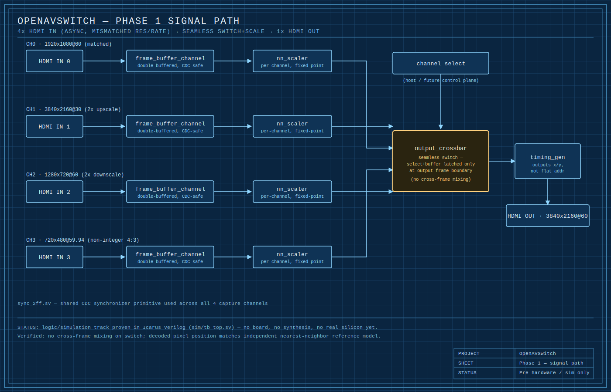

# OpenAVSwitch

> **AI-assisted project.** This codebase was created with [Claude](https://claude.com/claude-code)
> (Anthropic), directed and reviewed by a human author. Treat this as you
> would any early-stage hobby/community hardware project: nothing here has
> been through professional design review, third-party audit, or
> real-hardware validation yet (see [Status](#status) below). Read the
> design docs and RTL critically, especially before relying on this for
> anything beyond simulation.

An open, modular AV processing mainframe in the spirit of the Analog Way
Aquilon / Barco E3 class of live-event video processors: multiple
simultaneous inputs, multi-layer real-time compositing/scaling, and seamless
switching, built on commodity FPGA SoCs instead of closed proprietary
hardware.

## Disclaimers

**Relationship to MiSTer FPGA:** this project is *inspired by* the
[MiSTer FPGA project](https://github.com/MiSTer-devel) — its open,
community-driven, reproducible approach to FPGA hardware — but it is
**not** a MiSTer fork, derivative, or dependent in any way. No MiSTer
code, cores, or framework are used here. MiSTer's DE10-Nano/Cyclone V
target has no HDMI input path and essentially no spare logic or DDR3
bandwidth once its HPS Linux bridge is accounted for, so it's the wrong
technical base for this project regardless; everything in `rtl/` and
`docs/` here is original, targeting Xilinx/AMD Zynq UltraScale+ instead.
See [docs/architecture.md](docs/architecture.md) for the full reasoning.

## Vision

A chassis-style system: a host/control card plus a bus of pluggable I/O
daughtercards (HDMI, SDI, DisplayPort, and eventually third-party capture
cards like Blackmagic DeckLink), all feeding a real-time layer
compositor/scaler/switcher core, scaling up from a single input/output pair
to many simultaneous 4K/8K inputs across multiple layers.

## Status

Pre-hardware. The Phase 1 **logic/simulation track** is done and passing:
a double-buffered continuous-capture pipeline, a per-channel
nearest-neighbor scaler, and a frame-boundary-latched seamless switch,
all proven in Icarus Verilog simulation across 4 asynchronous,
mismatched-resolution simulated sources — see [sim/README.md](sim/README.md).

The Phase 1 **carrier-board schematic capture** is now underway in KiCad
([hardware/carrier-board/](hardware/carrier-board/)): a Trenz TE0807
(Zynq UltraScale+) SOM carrier with 3 native HDMI inputs + 1 native HDMI
output. All 4 SOM connectors, HDMI connectors, DDC level translators,
HPD circuitry, TMDS wiring through ESD protection to exact GTH B2B pins,
the Si5341A reference-clock tree, power sequencing, and decoupling are
placed and ERC-validated — see
[hardware/carrier-board/README.md](hardware/carrier-board/README.md)
for detailed status and remaining items (VCCO regulators, DDC GPIO
pin-out, EDID firmware).

Nothing has been synthesized or run on real silicon yet; no board has
been fabricated. See [docs/](docs/) for design docs and
[docs/roadmap.md](docs/roadmap.md) for the phased plan.

## Phase 1 goal

A single board (no card cage yet): 4x HDMI input, 4K-capable, seamlessly
switched/scaled to 1x HDMI output. Proves the capture -> frame buffer ->
scale -> crossbar -> output pipeline before any of the modularity
(daughtercards, multi-layer compositing, third-party card support) is
layered on. Details in [docs/phase1-plan.md](docs/phase1-plan.md) and
[docs/roadmap.md](docs/roadmap.md).

## Roadmap / TODO

Full phased plan in [docs/roadmap.md](docs/roadmap.md). At a glance:

- [x] **Phase 0** — Architecture & specs
- [ ] **Phase 1** — 4-in / 1-out HDMI 4K seamless switcher *(logic/simulation track done; carrier-board KiCad schematic capture in progress; nothing built, synthesized, or run on silicon yet)*
- [ ] **Phase 2** — Multi-layer compositing
- [ ] **Phase 3** — Modular I/O daughtercards
- [ ] **Phase 4** — Chassis / card-cage productization
- [ ] **Phase 5** — Third-party capture card support (e.g. Blackmagic DeckLink)
- [ ] **Phase 6** — 8K

## Repo layout

- `docs/` — architecture, specs, roadmap
- `hardware/` — board/daughtercard designs; `carrier-board/` is the live
  Phase 1 KiCad project (see its README for schematic status)
- `rtl/` — FPGA HDL: capture, scaler, compositor, output, common/shared
- `sim/` — testbenches and simulation
- `host-sw/` — Linux-side control plane and third-party card drivers (e.g. DeckLink)
- `tools/` — build scripts, utilities
